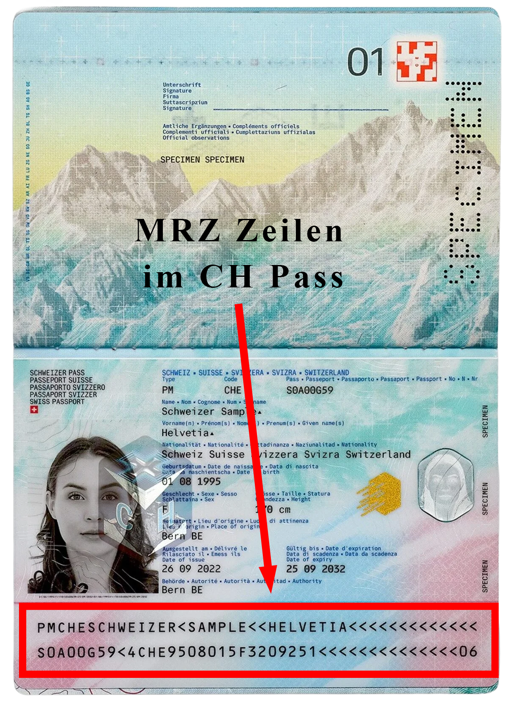
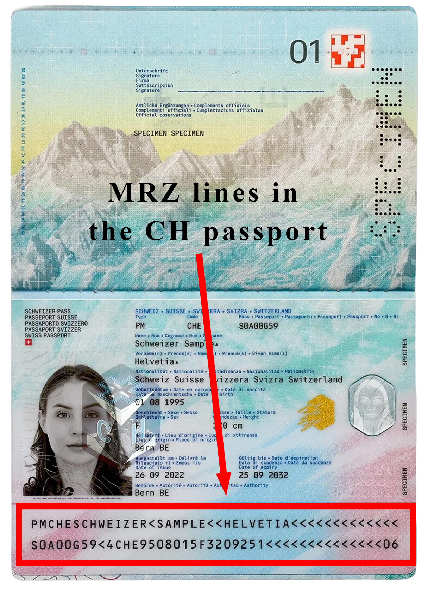
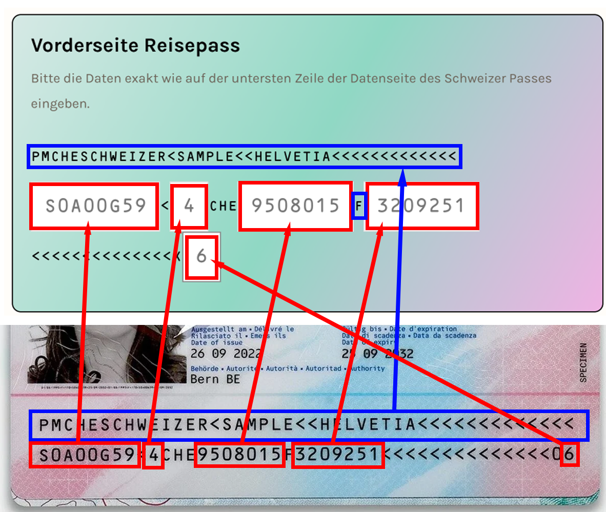
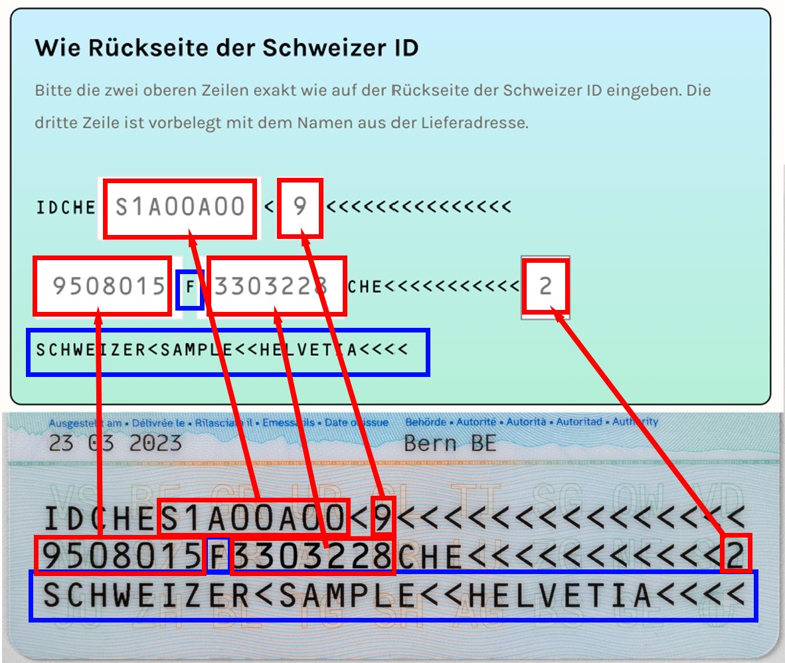
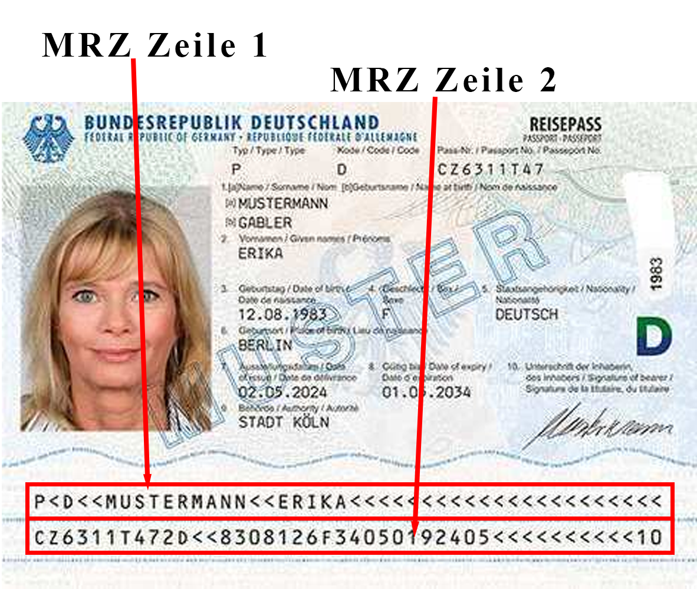

# Hilfe-Bilder fuer CMS-Seiten

Dieser Ordner ist fuer statische Hilfe-Bilder gedacht, die auf CMS-Seiten verwendet werden.

## Oeffentliche URL

Die Dateien sind unter folgendem Pfad erreichbar:

`/modules/internautenav/views/img/help/<dateiname>`

Beispiel:

`/modules/internautenav/views/img/help/swisspass-de.png`

## Verwendung in einer CMS-Seite

```html

```

## Vorhandene Platzhalter

- `swisspass-de.png`
  
- `swisspass-en.png`
  
- `aswisspasstoav.png`
  
- `swissidtoav.png
  
- eupass.png
  

## Benennungs-Konvention

- Nur Kleinbuchstaben
- Woerter mit Bindestrich trennen
- Nur ASCII-Zeichen in Dateinamen
- Sprachsuffix nutzen, falls noetig:
  - `-de`, `-en`, `-fr`, `-it`

## Hinweis

Keine Kunden-Uploads aus `uploads/` fuer CMS-Inhalte verwenden.
Diese sind fuer Verifikationsprozesse und Datenschutz-relevante Daten bestimmt.
